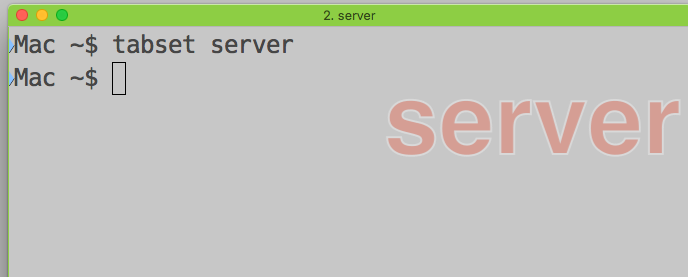
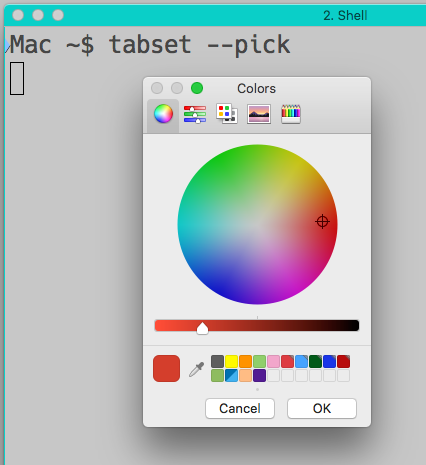
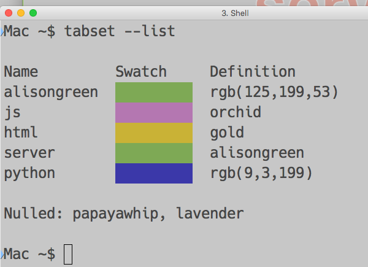

Tabset
------

Have a lot of iTerm2 windows open? They all look nearly indistinguishable?
And when you go to the `Window` menu to select one, figuring out
which one is impeded because they're all titled "Shell"?  `tabset`
can help.

`tabset` is designed to make life easier for those using iTerm2 on
the Mac. It provides a CLI command that allows easy setting of
iTerm2 tab/window titles, badges, and colors. If you have a lot of
tabs/windows in operation simultaneously, `tabset` helps to visually
distinguish them.

Installation
------------

    npm install -g iterm2-tab-set

(Depending on local security settings, you may need
to use `sudo npm ...` to authorize global installation.)
This will install the `tabset` command.

Usage
-----

The easiest usage is just to run the command:

    tabset

This will colorize the tab header, set the tab
title, and set the tab badge based on the current
working directory.  If all you want are tabs to
look a little different from each other, you're done.

For a little more precision, you can give a "tag" to
use instead of the current working directory. Perhaps
one related to the kind of work you're doing:

    tabset html

Different tags will create different-looking tabs.

More Precise Usage
------------------

If you want more control of what `tabset` is setting,
and how, read on.

    tabset --color <colorspec>

where <colorspec> names or defines acolor,
will set the tab header to that color.
By default `tabset` knows all the CSS color names,
and how to interpret CSS-style `rgb()` and hex
(e.g. `#663399`) color definitions. You can add
new color names if you like (see below).

If a color name is partially given (e.g. `alice`),
the corresponding color will be guessed (e.g.
`aliceblue`).  If more than one named color
shares that name fragment, the possible matches
will be listed, and one of them will be chosen
at random. Note that fragments that exactly match
a color name (e.g. `blue`) will not trigger a
search; if you want to search on all
all possible blues, use a string like `blu` that
isn't itself an actual color name.

You can see all of the color names with:

    tabset --colors

Special color names also recognized include `random`
(chooses a known named color at random) and
`RANDOM` (chooses an RGB color *completely*
at random, not just from the named color
palette).

If you choose to define your color precisely with RGB (e.g.
`rgb(102,51,153)`) or hex (e.g. `#663399`) color specs, note that quotes are
probably needed to avoid Unix shell ugliness. That's especially true for
`rgb()` colors, and true of hex specs if the optional but traditional `#`
prefix is used.

If you want to visually pick a color rather than
specify it textually:

   tabset --pick

Will launch the Mac color picker and set the color
based on its result.

In many cases, you may not care exactly what color is
chosen, just that like terminal tabs are similarly
colored. In this case, you can use hashed color option.

    tabset --hash <word>

will choose a color based on a hash of `<word>`. So if
you want all your JavaScript coding tabs to have one color,
`tabset --hash js` will do the trick. Other
words such as `css`, `html`, and `server` can be used
for other tabs and windows.
Any string can be used. Case *is* significant.
If you don't like the hashed selection, experiment with
variations. You might hate `--hash js`, but find
`--hash js_`, `--hash JS` or `--hash javascript` to be just right

Titles and Badges
-----------------

Beyond being distinguished by header color, iTerm2 tabs can have titles and
badges. Titles appear in either the tab bar or as the window title. Badges
are a large-font watermark that appears behind the tab's normal content.
(Badges require iTerm2 Version 3 or later.)

    tabset --badge "server 1"

Sets the badge watermark to "server 1". The quotes are needed
to manage the Unix shell argument handling. Single word badges
and titles do not need to be quoted, but any that include spaces
should be. You can also embed newlines with `\n`.
Unicode characters are also possible (easiest with cut-and-paste,
since Unicode codepoints are difficult to specify in many shells).

iTerm2 defines some variables that badges can live-display. For example,
to track the current working directory:

    tabset --badge '\(session.path)'

For more of these, see
[the iTerem 2 docs](https://www.iterm2.com/documentation-badges.html).

To set tab titles:

    tabset --title server

iTerm2 has a complex system for setting tab title, window title, or both,
controlled with a mode flag. You can specify this with `--mode`
values of 0, 1, or 2, if you are so inclined. The default, modeless
operation will often suffice.

Config File
-----------

If you want to add your own named colors, create a JSON file
in your home directory called `.tabset`.

Give it a `colors` map, like so:

    {
      "colors": {
        "alisongreen": "rgb(125,199,53)",
        "js": "orchid",
        "html": "gold",
        "server": "alisongreen",
        "papayawhip": null
      }
    }

Now new colors are defined for `js`, `html`, and other names. They can be
defined in terms of existing color names (making them, in effect, aliases),
or through direct `rgb()` or hex CSS formats.

Once you've added a named color, you use it just like you would use one of
the predefined CSS color names. For example here a color `alisongreen` is
defined, then the `server` color refers to `alisongreen`. The only
restriction is that color names must be defined before they are used.

If you really don't like a color and do not want it included in your
palette, remove it from service by defining its value as `null`. The
example above nixes `papayawhip`.

You can also redefine the default color, using the key `default`.

The fastest way to get going with your own named colors is:

    tabset --init

Which will create a sample
`.tabset` in your `$HOME` directory if it does
not already exist.

`tabset` also provides commands to make selecting and update
custom color
names easier.

    tabset --add python "rgb(9,3,199)"

Will do the trick. Or to visually select the color:

    tabset --add python --pick

Will bring up the Mac color picker, and set the result
as your named color.

    tabset --del python

Will remove that custom definition. And

    tabset --list

Will list out all currently-defined custom colors.
(There are many online resources for exploring the
base set of CSS named colors. For example,
[this one](http://www.crockford.com/wrrrld/color.html).)

Shortcuts
---------

All of the major options can be abbreviated. `tabset --badge js` can be
said as just `tabset -b js`. Similarly for `-c` instead of `--color`,
`-h` instead of `--hash`, `-p` for `--pick`, and `-t` instead of `--title`.

Finally, there is an `--all` or `-a` all-in-one option that sets the color, badge, and
title simultaneously. This is where it's especially helpful to define named
colors for the types of tabs you masy want. You don't even really need to
specify the `-a` flag; if no flag is provided, `--all` is assumed.

    tabset js

For example will label everything it can find with `"js"` and set the `js` color.
If no color named `js` is defined, a hashed color will be guessed.

You can also mix and match. E.g.:

    tabset js -t one.js

Makes everything `js`, except the title which is `one.js`. Conversely

    tabset js -b one.js

Sets everything to `js` except the badge, which reflects the file name.

Mix and match to suit your workflow.
